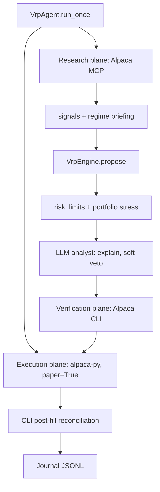

# Architecture — how the engine is wired

Where to look, where to change things, and why the pieces are separated the way they
are. The strategy maths lives in [strategy.md](strategy.md); the broker surfaces are in
[mcp-and-cli.md](mcp-and-cli.md).

## Three planes

Three clients read the same account, on purpose. Only one of them can move money.



| Plane | Module | Job | Can it trade? |
| --- | --- | --- | --- |
| Execution | `alpaca/client.py`, `alpaca/orders.py` | The only path to `submit_order`, always after `review_proposal` | Yes, and only here |
| Verification | `alpaca/cli_bridge.py` | Second client, second auth path: pre-trade cross-check, post-fill reconciliation, independent clock | No |
| Research | `alpaca/mcp_bridge.py` | Read-only tools: regime briefing, second opinion on option quotes | No — enforced by an allow-list in code |

The separation is not decoration. A single client that both reads and writes has no way
to notice that its own view of the book has gone stale, and a stale view is how an
unattended agent doubles a position it thought it had closed.

## The cycle

`agent/loop.py`, one pass:

```
observe -> guard -> signals -> portfolio -> propose -> risk
        -> research -> analyst -> CLI verify -> execute -> reconcile -> journal
```

1. **Observe** — clock, account, positions, options buying power. Daily bars and the
   multi-expiry chain for each name in the universe. Held legs outside the chain window
   get their own snapshot fetch so nothing is left without a mark.
2. **Guard** — `risk/account.py`: daily loss breaker, drawdown from the journal's
   high-water mark, hard equity floor, session window. Produces two booleans,
   `new_risk_allowed` and `flatten_required`, that the strategy has to respect.
3. **Signals** — `strategy/signals.py` per underlying, pure.
4. **Portfolio** — `risk/portfolio.py` rebuilds the current book as a payoff curve, with
   worst case, stress ladder and beta-weighted greeks.
5. **Working orders** — stale limits are cancelled; an underlying with a live order is
   off-limits for the cycle. If the order list cannot be read at all, the cycle stands
   down rather than stack a ticket onto an invisible book.
6. **Propose** — `strategy/engine.py` returns exactly one `ProposedTrade`.
7. **Risk** — `risk/limits.py` re-prices the whole portfolio *as if the ticket had
   filled* and approves only if every budget still holds. Runs before the analyst, so no
   model output can talk its way past a budget.
8. **Research and cross-check** — MCP re-quotes the proposed legs; a divergence above
   tolerance kills the ticket rather than size a possibly stale edge.
9. **Analyst** — an LLM sees the finished ticket and may raise a soft veto from a fixed
   list. Fails open.
10. **Verify** — the CLI reads the book one last time. Disagreement stops the trade.
11. **Execute** — `submit_proposal`, dry-run unless `DRY_RUN=false` *and* the session is
    open.
12. **Reconcile** — the CLI reads the book again. A divergence freezes new entries; exits
    stay allowed, because a safety check must never trap the book it fired over.
13. **Journal** — the whole `AgentCycle` as one JSONL line.

Every step is wrapped so a single API fault degrades the cycle instead of killing the
loop. The agent is meant to run unattended for a week.

## Module map

### `config.py`

Every setting, and every risk budget expressed as a **fraction of equity** rather than a
dollar constant, so the same configuration behaves identically on a $10k and a $100k
account. `assert_paper_only()` aborts startup if `ALPACA_LIVE_TRADE` is truthy; there is
no live code path to enable.

### `alpaca/`

| Module | Role |
| --- | --- |
| `client.py` | Paper `TradingClient`, account, positions, spot prices, options buying power, open orders |
| `market_data.py` | Daily bars into a `PriceHistory` with log returns |
| `options.py` | Multi-expiry chain with quotes, greeks, IV and liquidity fields, normalised to `OptionCandidate`; OCC symbol parsing |
| `orders.py` | Separate open and close multi-leg builders, net limit at mid, dry-run |
| `cli_bridge.py` | Verification plane |
| `mcp_bridge.py` | Research plane |

`orders.py` carries the one broker constraint that shaped the design: **Alpaca accepts a
multi-leg order only when every leg is covered inside that same ticket**, which rules out
the classic single-ticket roll. Mixing opening and closing legs raises `OrderBuildError`
locally rather than travelling to the broker to be rejected there.

### `strategy/`

Everything here except `engine.py` is a pure function of data, which is why the test
suite can replay the entire decision surface offline with no network.

| Module | Role |
| --- | --- |
| `base.py` | Shared vocabulary: `ProposedTrade`, `ProposedLeg`, `TradeAnalytics`, `StrategyContext`, the `Strategy` protocol |
| `signals.py` | Realised vol, implied vol, VRP and its z-score, term-slope blackout, trend, beta |
| `structures.py` | Builds verticals and condors at several widths, with liquidity gates |
| `pricing.py` | Win probabilities under both measures, integrated expected loss, edge, wedge, ranking score |
| `sizing.py` | Fractional Kelly and the full clipping chain |
| `management.py` | The exit ladder and all-to-close exit tickets |
| `reset.py` | Unwind of inherited positions, in an order that never creates a naked short |
| `engine.py` | `VrpEngine`: orchestrates the above and returns one ticket |

### `risk/`

| Module | Role |
| --- | --- |
| `limits.py` | Defined-risk proof (every short leg paired with a long leg in the same ticket), per-ticket caps, post-fill portfolio budgets |
| `portfolio.py` | Payoff aggregation, exact worst case at breakpoints, stress ladder, beta-weighted delta / vega / theta |
| `account.py` | Daily breaker, high-water-mark drawdown, equity floor, session window |

`review_proposal` proves defined risk from the legs themselves rather than trusting the
label on the ticket. Naked shorts are not "disallowed", they are unrepresentable: a short
leg without a matching protective long in the same order is a rejection.

### `agent/`

| Module | Role |
| --- | --- |
| `loop.py` | The cycle above, plus freeze state and the working-order sweep |
| `analyst.py` | Regime briefing and the soft veto; every failure fails open |
| `tools.py` | Read-only tool surface for the LLM |

### `journal.py`

Append-only JSONL: one line per cycle, holding signals, the scanner head, the portfolio
digest, the proposal with its full analytics, the risk checks and the execution result.
It is also the drawdown breaker's memory — the high-water mark is read from here, not
from the starting balance, so a good week cannot be given back unnoticed.

### `app/streamlit_app.py`

Equity curve, open structures with greeks and live expected value, the ranked opportunity
scanner, the portfolio payoff curve with stress markers, risk-budget gauges, and the
decision journal. If it is not visible here, for a judge it does not exist.

## Where to change what

| I want to… | Touch |
| --- | --- |
| Trade a different universe or expiry window | `.env` (`UNIVERSE`, `MIN_DTE`, `MAX_DTE`) |
| Be more or less aggressive | `.env` budget percentages; nothing in code |
| Change which structure a signal produces | `strategy/structures.py` |
| Change the acceptance test | `strategy/pricing.py` (`MIN_EDGE`, `MIN_WEDGE` in config) |
| Change how big a stake gets | `strategy/sizing.py` |
| Change exit discipline | `strategy/management.py` |
| Add a hard rule the model cannot bypass | `risk/limits.py` or `risk/account.py` |
| Add a whole new strategy | Implement the `Strategy` protocol from `strategy/base.py` and pass it to `VrpAgent` |

## Testing

580+ tests, no network, no keys. `tests/conftest.py` holds the shared fakes: a
Black–Scholes chain builder that produces *coherent* quotes (so a test cannot accidentally
pass on an arbitrage), synthetic price histories with a chosen volatility and trend, and
duck-typed account, position and client stubs.

An autouse fixture severs `Settings` from the local `.env` and clears Alpaca environment
variables, so the suite behaves the same on a developer machine and in CI.

```bash
uv run pytest
uv run ruff check .
```

Both run on every push (`.github/workflows/`).

## Layout

```
alpaca-vrp-engine/
  README.md            ← what GitHub and a clone see first
  AGENTS.md            ← context for Cursor and other AI agents
  pyproject.toml       ← dependencies, extras and console scripts (uv)
  .env.example         ← every variable, values empty
  src/vrp_engine/      ← the product
  app/                 ← Streamlit dashboard
  scripts/             ← smoke test, broker report, agent runner
  tests/               ← offline, keyless
  docs/                ← strategy maths, this file, broker planes
  .github/workflows/   ← CI: tests + lint
```
